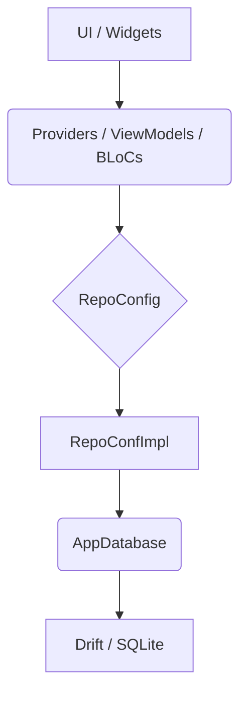

Como Senior Technical Writer experto en Flutter, aquí tienes la documentación en formato Markdown para `repoconfigimpl.dart`.

---

# Documentación del Componente: `RepoConfImpl`

Este documento detalla la implementación del repositorio de configuración de usuario (`RepoConfImpl`), el cual es crucial para gestionar las preferencias del usuario dentro de la aplicación, como la habilitación de TTS (Text-to-Speech) o la música de fondo.

## 📝 Resumen

`RepoConfImpl` es la implementación concreta de la interfaz `RepoConfig`, encargada de interactuar con la base de datos local (utilizando `Drift` como ORM) para persistir y recuperar la configuración del usuario. Este componente abstrae los detalles de la base de datos del resto de la aplicación, proporcionando una API limpia para gestionar las preferencias. Garantiza que siempre haya una configuración disponible, ya sea recuperada de la base de datos o proporcionando valores predeterminados si no existe ninguna.

## 🏛️ Arquitectura

Este componente se inserta directamente en la capa de **Repositorio** de una arquitectura MVVM-C (Model-View-ViewModel-Coordinator), Clean Architecture, o cualquier patrón que separe la lógica de datos de la lógica de negocio y la interfaz de usuario.

*   **Widget/UI:** La capa de interfaz de usuario (Widgets) nunca interactúa directamente con `RepoConfImpl`. En su lugar, interactúa con un `ViewModel` o `Provider` (o `Bloc`), que a su vez utiliza `RepoConfImpl`.
*   **Provider (o BLoC/ViewModel):** Las clases que implementan la lógica de negocio (por ejemplo, un `SettingsProvider` que gestiona el estado de las preferencias) inyectarán una instancia de `RepoConfig` (generalmente a través de `RepoConfImpl`). Este `Provider` llamará a los métodos `getSettings` o `upsertSettings` para obtener o actualizar las preferencias del usuario.
*   **Repo (`RepoConfImpl`):** Esta es la capa que estamos documentando. Su responsabilidad principal es ser la única fuente de verdad para la configuración del usuario, mediando entre la capa de negocio y la capa de datos (la base de datos `Drift`). Implementa la interfaz `RepoConfig` para mantener un contrato claro.

## 🧩 Componentes Clave

Los elementos fundamentales que componen `RepoConfImpl` son:

### 1. `RepoConfImpl` Class

*   **Descripción:** La clase principal que implementa `RepoConfig`. Es responsable de toda la lógica de interacción con la base de datos para las configuraciones.
*   **Dependencias:** Requiere una instancia de `AppDatabase` en su constructor, siguiendo el patrón de Inyección de Dependencias.

### 2. `AppDatabase db`

*   **Descripción:** Una instancia del objeto `AppDatabase` (generado por `Drift`). Este es el punto de entrada para todas las operaciones de la base de datos.
*   **Uso:** `RepoConfImpl` utiliza este objeto para acceder a las tablas `tutor` y `configuraciones`.

### 3. `Future<Configuracion> getSettings(userId)` Method

*   **Descripción:** Este método es responsable de recuperar la configuración actual del usuario desde la base de datos.
*   **Lógica Clave:**
    *   Primero, recupera un registro de `tutor`. Se asume que solo existe un tutor o que la configuración está ligada al primer tutor encontrado.
    *   Luego, busca una configuración asociada a ese `tutorId` en la tabla `configuraciones`.
    *   **Manejo de Valores Predeterminados:** Si no se encuentra ninguna configuración para el `tutorId`, el método devuelve una instancia de `Configuracion` con valores predeterminados sensatos (TTS habilitado, velocidad de 0.5, música de fondo habilitada). Esto asegura que la aplicación siempre tenga un estado de configuración inicial, evitando `null`s.
    *   **Nota:** El parámetro `userId` se pasa, pero actualmente la lógica de recuperación se basa en el `tutorId` del primer tutor encontrado en la base de datos, sin utilizar directamente el `userId` proporcionado. Esto podría ser un punto de refactorización si la aplicación escala a múltiples usuarios/tutores.

### 4. `Future<void> upsertSettings(Configuracion a)` Method

*   **Descripción:** Este método se encarga de insertar o actualizar la configuración del usuario en la base de datos.
*   **Lógica Clave:**
    *   Utiliza la potente función `insertOnConflictUpdate` de `Drift`. Esto significa que si ya existe un registro de configuración para el `tutorId` dado, se actualizará. Si no existe, se insertará un nuevo registro.
    *   Convierte el objeto `Configuracion` a un `ConfiguracionesCompanion` para interactuar con la API de `Drift`, asegurando que todos los campos relevantes sean mapeados correctamente a `Value`s de `Drift`.
*   **Impacto:** Es la única forma de modificar y persistir la configuración del usuario.

### 5. `Configuracion` Entity

*   **Descripción:** Aunque no se define en este archivo, `Configuracion` es la entidad de dominio que representa la estructura de datos de las preferencias del usuario. `RepoConfImpl` trabaja directamente con esta entidad para la entrada y salida de datos.
*   **Campos Relevantes:** `tutorId`, `ttsHabilitado`, `ttsVelocidad`, `musicaFondo`.

---