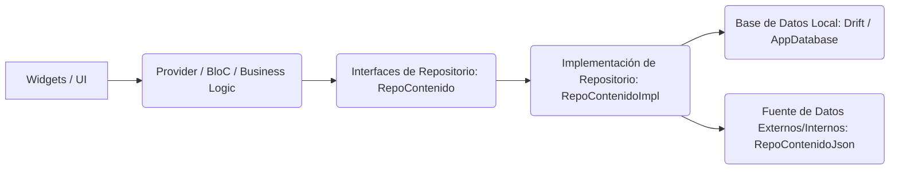

¡Excelente! Como un Senior Technical Writer experto en Flutter, analizaré el archivo `repocontimpl.dart` y generaré la documentación Markdown solicitada, enfocándome en su rol dentro de la arquitectura de una aplicación Flutter.

---

# Documentación Técnica: `RepoContenidoImpl`

Este documento detalla el componente `RepoContenidoImpl`, una implementación clave en la capa de datos de la aplicación, responsable de la gestión y provisión de contenido estático y dinámico a través de una base de datos local (Drift).

## Resumen

`RepoContenidoImpl` actúa como el **repositorio concreto para la gestión del contenido de la aplicación**. Su principal función es abstraer los detalles de la persistencia de datos (usando Drift) para el resto de la aplicación, especialmente para la lógica de negocio y las capas de presentación.

Este componente se encarga de:
1.  **Inicialización y Población:** Llenar la base de datos local con datos iniciales (actividades, módulos, etc.) provenientes de una fuente JSON, asegurando que el contenido base esté disponible al inicio de la aplicación o cuando sea necesario.
2.  **Consulta de Datos:** Proveer métodos para recuperar diferentes tipos de contenido (números, fonemas, palabras, módulos, actividades) de la base de datos de manera eficiente y asíncrona.
3.  **Abstracción:** Implementar la interfaz `RepoContenido`, lo que permite que las capas superiores interactúen con un contrato bien definido sin conocer los detalles de la implementación subyacente (por ejemplo, el uso de Drift o la lectura de JSON).

Es una pieza fundamental para garantizar que la aplicación tenga acceso rápido y offline a su contenido educativo.

## Arquitectura (Widget/Provider/Repository)

Este componente se ubica firmemente en la **Capa de Repositorio (Repository Layer)** de la arquitectura de la aplicación, adhiriéndose a principios de Clean Architecture y separación de preocupaciones.

1.  **Capa de Widgets / UI:** Los widgets de la interfaz de usuario **nunca interactúan directamente** con `RepoContenidoImpl`. Su único contacto es con la capa de `Provider` (o BLoC/Cubit), la cual les provee el estado y los datos necesarios.
2.  **Capa de Provider / Lógica de Negocio:** Esta capa (que podría ser un `ChangeNotifierProvider`, un `Bloc`, un `Cubit` o un `Riverpod` Provider) es la que **depende de la interfaz `RepoContenido`**. Cuando necesita datos (por ejemplo, la lista de módulos o actividades), invoca los métodos definidos en esa interfaz.
3.  **Interfaces de Repositorio (`RepoContenido`):** Define el **contrato** que `RepoContenidoImpl` debe cumplir. Esto es crucial para la inversión de dependencias y la testabilidad. La capa de lógica de negocio solo sabe que necesita un `RepoContenido`, no cómo está implementado.
4.  **`RepoContenidoImpl` (Este componente):** Es la **implementación concreta** de la interfaz `RepoContenido`. Aquí es donde se manejan todos los detalles de la persistencia de datos y la integración con las fuentes de datos.
    *   Recibe una instancia de `AppDatabase` (Drift) a través de su constructor, lo que facilita la inyección de dependencias.
    *   Utiliza internamente `RepoContenidoJson` para cargar datos iniciales, demostrando la capacidad de este repositorio para orquestar diferentes fuentes de datos.
5.  **Base de Datos Local (`Drift / AppDatabase`):** Es la tecnología subyacente de persistencia. `RepoContenidoImpl` traduce las solicitudes de la capa de lógica de negocio en operaciones SQL a través de la API de Drift.
6.  **Fuente de Datos Externos/Internos (`RepoContenidoJson`):** Representa una fuente de datos para la población inicial (e.g., archivos JSON en los assets de la aplicación). `RepoContenidoImpl` coordina la lectura de estos datos para la base de datos local.

Esta estructura asegura una alta cohesión dentro de la capa de repositorio y un bajo acoplamiento con las capas superiores, permitiendo que la lógica de negocio y la UI permanezcan agnósticas a los detalles de cómo se obtienen y almacenan los datos.

## Componentes Clave

A continuación, se describen los elementos más importantes dentro de `repocontimpl.dart`:

### 1. Clase `RepoContenidoImpl`

*   **Propósito:** Implementación principal del repositorio de contenido.
*   **Implementa:** `RepoContenido` (la interfaz que define el contrato).
*   **Dependencias:**
    *   `AppDatabase db`: Instancia de la base de datos local de Drift, inyectada a través del constructor. Esto permite una fácil sustitución en entornos de prueba.
    *   `_lectorJson = RepoContenidoJson()`: Una instancia interna de `RepoContenidoJson`. Es responsable de cargar datos iniciales desde archivos JSON (e.g., `assets/data/actividades.json`).
        *   **Nota de Diseño (Senior Technical Writer):** Si bien la instanciación interna es funcional, para una máxima flexibilidad y testabilidad, `_lectorJson` también podría inyectarse a través del constructor de `RepoContenidoImpl`. Esto desacoplaría aún más `RepoContenidoImpl` de la fuente específica de datos JSON.

### 2. Método `poblarBaseDeDatos()`

*   **Propósito:** Es el método crucial para la inicialización del contenido de la base de datos local. Garantiza que la aplicación tenga una base de datos poblada con la información esencial al arrancar o bajo demanda.
*   **Flujo Operativo:**
    1.  **Verificación de Existencia:** Consulta la tabla `actividades` para determinar si ya contiene datos. Si `conteo.isNotEmpty`, el método retorna inmediatamente, previniendo la repoblación redundante.
    2.  **Carga de Datos JSON:** Utiliza `_lectorJson.cargarActividades()` para obtener la lista de actividades de la fuente JSON configurada.
    3.  **Inserción en Batch (Drift):** Emplea `db.batch((batch) { ... })` para realizar múltiples operaciones de inserción de manera eficiente en una única transacción. Esto es significativamente más performante que insertar cada registro individualmente.
        *   **Actividades:** Inserta las actividades obtenidas del JSON en la tabla `actividades`. Se utiliza `InsertMode.insertOrIgnore` para manejar posibles conflictos de IDs de forma elegante, ignorando registros duplicados.
        *   **Módulo de Diagnóstico:** Inserta un módulo específico (`id: 0`, `nombre: "Evaluación Diagnóstica"`) en la tabla `modulos`. Este ID 0 se reserva explícitamente para este propósito. También usa `InsertMode.insertOrIgnore`.
        *   **Relación Actividades-Módulos:** Crea entradas en la tabla de unión `actividadesHasModulos` para vincular cada actividad (en este ejemplo, todas las cargadas) al módulo de diagnóstico (ID 0). Esto establece una relación muchos a muchos entre actividades y módulos. También con `InsertMode.insertOrIgnore`.
*   **Significado Arquitectónico:** Este método es un ejemplo claro de cómo el repositorio orquesta diferentes fuentes de datos (JSON) y tecnologías de persistencia (Drift) para construir el estado inicial de la aplicación.

### 3. Métodos de Consulta (Ej. `getNumeros()`, `getFonemas()`, `getPalabrasPorTipo()`, `getModulos()`)

*   **Propósito:** Proveer una API limpia y asíncrona para que las capas superiores accedan a los datos almacenados en la base de datos.
*   **Implementación:**
    *   Son funciones `Future<List<T>>` que devuelven listas de los respectivos objetos de entidad (e.g., `Numero`, `Fonema`).
    *   Utilizan las APIs de consulta de Drift (ej. `db.select(db.numeros).get()`) para recuperar los datos.
    *   `getPalabrasPorTipo(int tipoId)` demuestra la capacidad de realizar consultas filtradas utilizando la cláusula `where` de Drift (`.where((t) => t.tipoDePalabraId.equals(tipoId))`).
*   **Significado Arquitectónico:** Estos métodos exponen la funcionalidad del repositorio de manera agnóstica a la base de datos. Quien los consume no necesita saber que se está usando Drift; solo sabe que puede obtener una lista de `Palabra` filtrada por un `tipoId`.

---

Este documento debería proporcionar una comprensión clara del propósito, la ubicación arquitectónica y el funcionamiento interno de `RepoContenidoImpl` para cualquier desarrollador que trabaje en el proyecto.